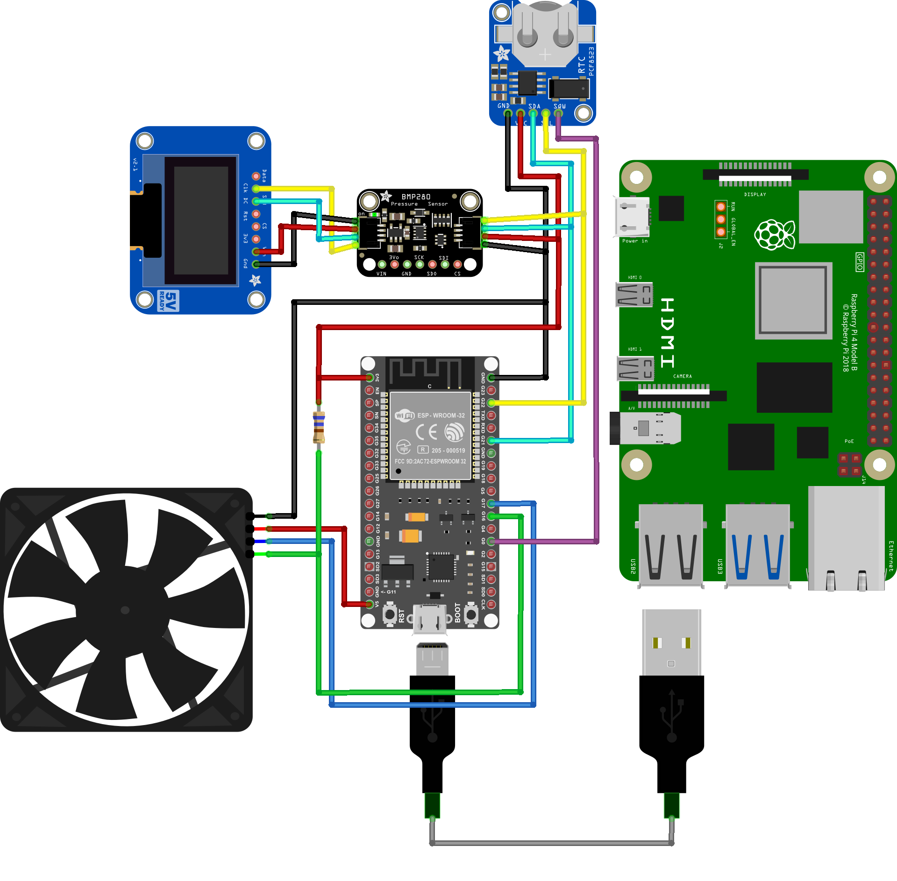

# Sistema di acquisizione dati per il monitoraggio ambientale

Progetto didattico del corso di Sistemi Operativi Dedicati di laurea magistrale 2022-2023 presso l'università Politecnica delle Marche. 

<details>
  <summary>Indice</summary>
  
  - [Descrizione del Progetto](#descrizione-del-progetto)
    - [Strumenti Utilizzati](#strumenti-utilizzati)
       - [Componenti Software](#componenti-software)
       - [Componenti Hardware](#componenti-hardware)
       - [Linguaggi di Programmazione](#linguaggi-di-programmazione)
    - [Funzionamento](#funzionamento)
  - [Struttura Repository](#struttura-repository)
  - [Installazione Locale](#installazione-locale)
  - [Utilizzo](#utilizzo)
  - [Autori](#autori)
</details>

## Descrizione del Progetto
Il progetto ha l'obiettivo di realizzare un sistema completo per il monitoraggio, la visualizzazione e il controllo dei parametri ambientali. Combinando hardware e software, il sistema è progettato per acquisire, elaborare e visualizzare i dati raccolti da vari sensori.

### Strumenti Utilizzati
Il sistema è composto da diversi componenti hardware e software, progettati per lavorare insieme al fine di monitorare e controllare i parametri ambientali. Di seguito è riportato un riassunto dei principali strumenti utilizzati.

#### Componenti hardware
- **ESP32**: Responsabile dell'acquisizione dei dati dal sensore BMP280, del controllo della ventola tramite segnale PWM, della sincronizzazione del modulo RTC tramite un comando inviato periodicamente dalla Raspberry Pi, e della visualizzazione delle informazioni sul display OLED.
- **Raspberry Pi 4**: Agisce come server IoT, ricevendo i dati dalla ESP32 tramite comunicazione seriale, memorizzando i dati in un database e rendendoli disponibili agli utenti tramite un'interfaccia web semplice e intuitiva.
- **Sensore BMP280**: Utilizzato per monitorare la temperatura e la pressione.
- **Ventola**: Attivata e controllata dall'ESP32 per raffreddare il sistema quando la temperatura supera una soglia predefinita.
- **Display OLED**: Mostra in tempo reale le informazioni sulla temperatura, la pressione e la velocità della ventola.
- **Modulo RTC**: Sincronizza l'orario con la Raspberry Pi.

#### Componenti software

-   **(v. 1.8.19)**
-   **(v. 1.1.9)**
-    **(v. 3.0.1)**
- 
-    **(v. 2.4.57-2)**


#### Linguaggi di Programmazione
-  e  
-   **(v. 3.11.2)**
- 
-  

  
#### Funzionamento:
- La scheda ESP32 acquisisce i dati dal sensore BMP280, controlla la ventola e visualizza le informazioni sul display OLED.
- I dati acquisiti vengono inviati alla Raspberry Pi, che li memorizza in un database e li rende disponibili tramite un'interfaccia web.
- Il sistema consente di visualizzare tendenze e di eseguire semplici analisi dei dati raccolti.
- Un bot Telegram permette agli utenti di richiedere dati specifici e di ricevere visualizzazioni grafiche e valori statistici.
- Notifiche di allarme vengono inviate tramite il bot Telegram agli utenti registrati se la temperatura supera una soglia critica.


Ad ogni modo, il primo passaggio consiste nel collegare i vari dispositivi sulla breadboard, come mostrato nella figura che segue. [aggiungere figura dei collegamenti dal punto di vista elettronico].

<!---->
<p align="center">
  
</p>

## Organizzazione Repository 

## Installazione locale 
Il progetto è articolato in due principali sezioni: la prima riguarda l'ESP32, mentre la seconda si concentra sulla Raspberry Pi 4. Di seguito sono riportate le sezioni relative a ciascuna di queste macro-aree. 

### ESP32
#### Arduino IDE
Installare l'[IDE di Arduino](https://www.arduino.cc/en/software) `v1.8.19` a seconda del sistema operativo utilizzato e   seguire le istruzioni nella finestra di installazione. 
Una volta installato, aprire l'Arduino IDE e configurarlo al file di utilizzarlo con una board di tipo ESP32:

- **Installare il driver per la comunicazione USB-seriale**

   Se questo non viene installato automaticamente al collegamento del microcontrollore, è necessario scaricarlo dal sito di [Silicon Labs](https://www.silabs.com/interface/usb-bridges/classic/device.cp2102).

- **Abilitare il supporto per la piattaforma EPS3**

   Andare su `File > Preferenze`, nella sezione
`"URL aggiuntivi per il Gestore delle Schede"`, e incollare il seguente URL:
https://dl.espressif.com/dl/package_esp32_index.json
NB. Se ci sono già altri URL, aggiungere una virgola alla fine e poi incollare il nuovo URL.

- **Installazione del tipo di scheda ESP32**
  
    Andare su `Strumenti > Scheda > Gestore delle Schede`. Nella casella di ricerca digitare `esp32` e installare la versione `2.0.11` della scheda prodotta da *Espressif Systems*.

- **Selezione della scheda ESP32**

    Andare su `Strumenti > Scheda` e selezionare `ESP32 Dev Module`.

- **Selezione della porta**

    Collegare la scheda ESP32 al pc tramite un cavo USB. Andare su `Strumenti > Porta` e selezionare la porta corrispondente alla scheda (es. `COM3` su *Windows* o `/dev/ttyUSB0` su *Linux*).

- **Caricamento del codice**

    Scrivere o aprire uno sketch per ESP32 e cliccare su `Carica`. Se non funziona al primo tentativo, premere il pulsante `Boot` sul dispositivo ESP32 durante il caricamento.

Per utilizzare correttamente il progetto con l'ESP32, è necessario installare librerie specifiche nell'ambiente di sviluppo Arduino IDE con le rispettive versioni:

 - **RTClib.h**                       `v2.1.3`
 - **Adafruit_BMP280.h**       `v2.6.8`
 - **Adafruit_GFX.h**          `v1.11.9` 
 - **Adafruit_SSD1306.h**  `v2.5.9`


### RaspBerry Pi 4
#### Installazione di L.A.M.P e librerie necessarie 

##### LINUX
Per installare il sistema operativo sulla Raspberry Pi scaricare [Raspberry Pi Imager](https://www.raspberrypi.com/software/). Terminata l'installazione, dalla schermata iniziale del tool selezionare il modello specifico di Raspberry Pi, il sistema operativo e la scheda SD per la memorizzazione dello stesso sistema operativo. Al termine di ciò, viene aperta una nuova finestra di dialogo per la configurazione personalizzata delle seguenti impostazioni: 

- **Nome Host** per identificare facilmente il dispositivo nella rete
- **SSH** per consentire connessioni sicure e crittografate al dispositivo
- **Wi-Fi** per garantire l'accesso a Internet inserire l'SSID e la password della rete wireless

Al termine del processo inserire la microSD nella Raspberry Pi e connettersi a quest'ultima utilizzando il comando: 

```bash
ssh [username]@[IP_address]
```

Prima di procedere con l'installazione dei successivi pacchetti necessari è buona pratica aggiornare l'elenco dei pacchetti, risolvere le dipendenze e migliorare la sicurezza del sistema, tramite il comando:

```bash
 sudo apt update && sudo apt upgrade
```


## Utilizzo

## Autori

|Nome autore 
|-----
|`Ciuffreda Silvia`
|`Liberatore Luca`
|`Serafini Andrea`

