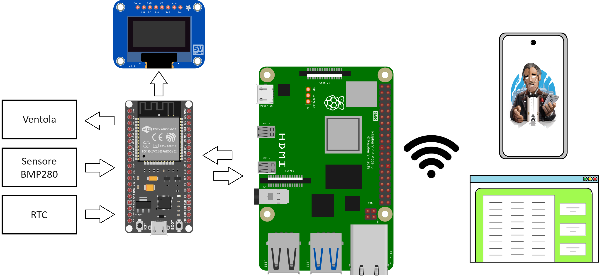

# Sistema di acquisizione dati per il monitoraggio ambientale

Progetto didattico del corso di Sistemi Operativi Dedicati di laurea magistrale 2022-2023 presso l'università Politecnica delle Marche. 

  
Indice

  
  - [Descrizione del Progetto](#descrizione-del-progetto)
    - [Strumenti Utilizzati](#strumenti-utilizzati)
       - [Componenti Software](#componenti-software)
       - [Componenti Hardware](#componenti-hardware)
       - [Linguaggi di Programmazione](#linguaggi-di-programmazione)
    - [Funzionamento](#funzionamento)
  - [Struttura Repository](#struttura-repository)
  - [Installazione Locale](#installazione-locale)
  - [Utilizzo](#utilizzo)
  - [Autori](#autori)

## Descrizione del Progetto
Il progetto ha l'obiettivo di realizzare un sistema completo per il monitoraggio, la visualizzazione e il controllo dei parametri ambientali. Combinando hardware e software, il sistema è progettato per acquisire, elaborare e visualizzare i dati raccolti da vari sensori.

### Strumenti Utilizzati
Il sistema è composto da diversi componenti hardware e software, progettati per lavorare insieme al fine di monitorare e controllare i parametri ambientali. Di seguito è riportato un riassunto dei principali strumenti utilizzati.

#### Componenti hardware
- **ESP32**: Responsabile dell'acquisizione dei dati dal sensore BMP280, del controllo della ventola tramite segnale PWM, della sincronizzazione del modulo RTC tramite un comando inviato periodicamente dalla Raspberry Pi, e della visualizzazione delle informazioni sul display OLED.
- **Raspberry Pi 4**: Agisce come server IoT, ricevendo i dati dalla ESP32 tramite comunicazione seriale, memorizzando i dati in un database e rendendoli disponibili agli utenti tramite un'interfaccia web semplice e intuitiva.
- **Sensore BMP280**: Utilizzato per monitorare la temperatura e la pressione.
- **Ventola**: Attivata e controllata dall'ESP32 per raffreddare il sistema quando la temperatura supera una soglia predefinita.
- **Display OLED**: Mostra in tempo reale le informazioni sulla temperatura, la pressione e la velocità della ventola.
- **Modulo RTC**: Sincronizza l'orario con la Raspberry Pi.

#### Componenti software

-   **(v. 1.8.19)**
-   **(v. 1.1.9)**
-    **(v. 3.0.1)**
- 
-    **(v. 2.4.57-2)**

#### Linguaggi di Programmazione
-  e  
-   **(v. 3.11.2)**
- 
-  

  
#### Funzionamento:
- La scheda ESP32 acquisisce i dati dal sensore BMP280, controlla la ventola e visualizza le informazioni sul display OLED.
- I dati acquisiti vengono inviati alla Raspberry Pi, che li memorizza in un database e li rende disponibili tramite un'interfaccia web.
- Il sistema consente di visualizzare tendenze e di eseguire semplici analisi dei dati raccolti.
- Un bot Telegram permette agli utenti di richiedere dati specifici e di ricevere visualizzazioni grafiche e valori statistici.
- Notifiche di allarme vengono inviate tramite il bot Telegram agli utenti registrati se la temperatura supera una soglia critica.

## Organizzazione Repository 

## Installazione locale e utilizzo 

## Autori

|Nome autore 
|-----
|`Ciuffreda Silvia`
|`Liberatore Luca`
|`Serafini Andrea`

Nel contesto del corso "Sistemi Operativi Dedicati", il presente progetto si propone di realizzare un sistema completo per il monitoraggio, la visualizzazione e il controllo dei parametri ambientali. Utilizzando una combinazione di hardware e software, il sistema è progettato per acquisire, elaborare e visualizzare dati ottenuti tramite molteplici sensori. In particolare, il sistema monitora costantemente i parametri ambientali tramite il sensore BMP280; quando la condizione termica supera una soglia predefinita, la ventola viene attivata per raffreddare il sistema e mantenere la temperatura entro il range desiderato. La velocità della ventola è proporzionale allo scostamento della temperatura attuale rispetto a quella desiderata. Le informazioni acquisite di temperatura, pressione e velocità della ventola vengono visualizzate sul display OLED e inviate alla Raspberry Pi insieme al timestamp corrispondente. La Raspberry Pi memorizza i dati all'interno di un database e genera notifiche di alert qualora la temperatura superi una ulteriore soglia critica. Gli alert vengono inviati tramite il bot Telegram "SensorDataRPI_bot" a tutti gli utenti registrati. Inoltre, la Raspberry Pi mette a disposizione i dati memorizzati nel database attraverso una semplice pagina web.

Per ulteriore dettagli riferirsi al file pdf contenuto in "/project_SOD/gruppo4_consegnaSOD".

